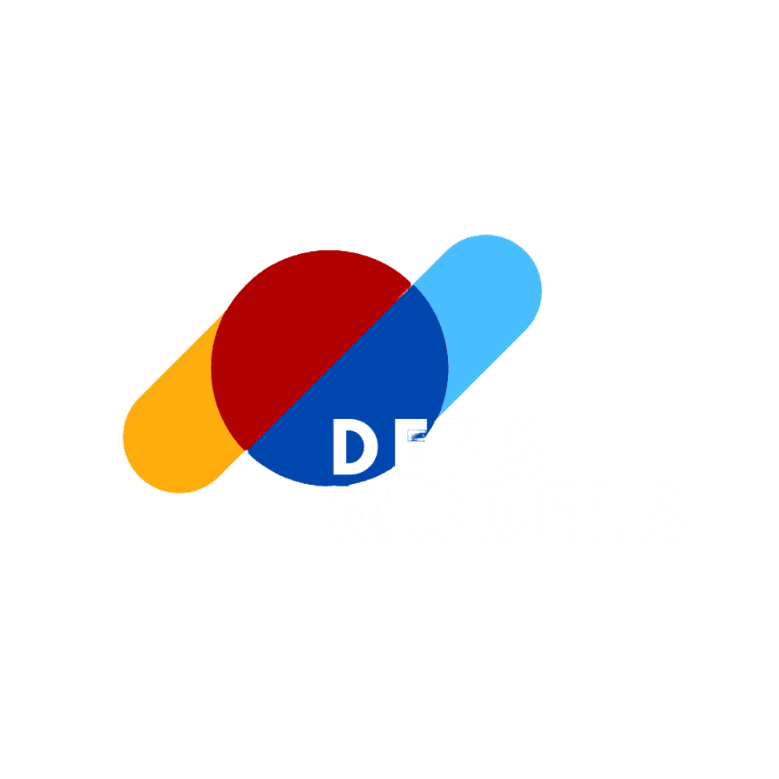

# Stock DEPS 📦

[](./README.en.md)



## 📋 Descrição

O **Stock DEPS** é um sistema de gerenciamento de estoque robusto e intuitivo, desenvolvido para facilitar a organização e controle de produtos, clientes, fornecedores e movimentações de estoque. O sistema foi projetado com tecnologias modernas e utiliza a arquitetura **MVC** (Model-View-Controller) para oferecer uma solução escalável e eficiente.

## 🎬 Demonstração

Veja o Stock DEPS em ação! Confira nossa demonstração completa das principais funcionalidades:

<div align="center">
  
</div>

> 📱 **Quer ver mais detalhes?** [Clique aqui para visualizar em tamanho completo](assets/web/images/demo/demo.gif)

> ⏳ **Nota**: A demonstração pode demorar alguns segundos para carregar devido ao tamanho do arquivo. Por favor, aguarde!

## 🖥 Funcionalidades Principais

### Dashboard
- Resumo geral com:
  - Total de produtos cadastrados.
  - Produtos em estoque.
  - Produtos com estoque baixo (alerta de necessidade de reposição).
  - Produtos sem estoque.
  - Total de clientes e fornecedores cadastrados.
  - Total de entradas e saídas de produtos.
- Ferramentas visuais:
  - **Lucro por Período**: Cálculo do lucro em um intervalo de tempo definido.
  - **Gráfico de Pizza**: Distribuição visual dos produtos por categoria.
  - **Produtos Mais Vendidos**: Lista detalhada dos itens com maior número de vendas.

### Gerenciamento de Estoque
- Cadastro de categorias e produtos.
- Gerenciamento de entradas e saídas do estoque.
- Edição e exclusão de produtos para manter os dados atualizados.

### Clientes e Fornecedores
- Cadastro e gerenciamento de informações de clientes.
- Cadastro e gerenciamento de fornecedores.

### Relatórios
- Geração de relatórios em **PDF** ou **Excel**, contendo informações relevantes, como movimentações do estoque, clientes cadastrados e fornecedores.

## 🔧 Tecnologias Utilizadas

- **PHP**: Para a lógica de back-end e comunicação com o banco de dados.
- **CSS**: Para estilização e apresentação visual.
- **JavaScript**: Para a interatividade e funcionalidades dinâmicas.
- **Bootstrap**: Para garantir uma interface moderna e responsiva.
- **Arquitetura MVC**: Para manter a organização modular do sistema, separando dados (Model), interface (View) e lógica de aplicação (Controller).

## 🧪 Testando o Projeto

Para testar o projeto em seu ambiente local, siga os passos abaixo:

### Pré-requisitos

- **XAMPP** (ou outro servidor local com Apache, MySQL e PHP)
- **Composer** (gerenciador de dependências PHP)
- **Node.js** e **npm** (para dependências JavaScript)

### 1. **Configurar o ambiente XAMPP**

1. Baixe e instale o [XAMPP](https://www.apachefriends.org/)
2. Inicie os serviços **Apache** e **MySQL** no painel de controle do XAMPP
3. Clone ou baixe este repositório na pasta `htdocs` do XAMPP:
   ```bash
   cd C:\xampp\htdocs
   git clone [URL_DO_REPOSITORIO]
   ```

### 2. **Configurar o banco de dados**

1. Acesse o **phpMyAdmin** através do navegador: `http://localhost/phpmyadmin`
2. Crie um novo banco de dados chamado `stockDeps`
3. Importe o arquivo SQL localizado em `01-bd/stockDeps.sql`:
   - Clique na aba "Importar"
   - Selecione o arquivo `stockDeps.sql`
   - Clique em "Executar"

### 3. **Instalar as dependências do PHP**
   
Se você ainda não tem as dependências do Composer instaladas, execute o comando abaixo para instalar ou atualizar:

```bash
composer install
```
ou, se precisar atualizar:

```bash
composer update
```

### 4. **Instalar as dependências do Node.js**

Em seguida, instale ou atualize as dependências do Node.js:

```bash
npm install
```
ou, para atualizar as dependências:

```bash
npm update
```

### 5. **Acessar o sistema**

Após configurar tudo, acesse o sistema através do navegador:

```
http://localhost/stockDeps
```

### 6. **Credenciais de acesso**

O sistema possui as seguintes credenciais pré-cadastradas:

| Usuário | Senha | Observações |
|---------|-------|-------------|
| `teste` | `teste` | ✅ **Recomendado para testes** - Acesso completo ao sistema |
| `demoAdmin` | `demoAdmin` | ⚠️ Redireciona para tela de admin (ainda não desenvolvida) |

**Para testar o sistema, utilize as credenciais `teste` / `teste`**, pois o usuário `demoAdmin` redireciona para uma área administrativa que ainda está em desenvolvimento.

## 📈 Benefícios Reais: Já Utilizado no Dia a Dia Empresarial

O **Stock DEPS** está sendo utilizado no dia a dia de uma empresa real, proporcionando uma gestão mais eficiente e precisa. Com a utilização do sistema, foi possível:
- Economizar tempo no cadastro de produtos.
- Identificar rapidamente produtos com estoque baixo ou zerado.
- Tomar decisões baseadas em relatórios e gráficos detalhados.
- Manter a operação organizada e controlada.

Essa experiência comprova que o **Stock DEPS** é uma solução robusta, confiável e capaz de atender às necessidades do seu negócio.

## 🌟 Por Que Escolher o Stock DEPS?

- **Simplicidade**: Interface intuitiva que qualquer colaborador consegue usar.
- **Eficiência**: Reduza o tempo gasto com tarefas manuais e concentre-se no que realmente importa.
- **Organização**: Centralize informações e tenha total controle sobre o estoque.
- **Segurança**: Dados protegidos por tecnologias modernas.
- **Testado e aprovado**: Utilizado no dia a dia de uma empresa real para garantir resultados confiáveis.

## 👥 Contribuidores

<table>
  <tr>
    <td align="center">
      <a href="https://github.com/elano-tavares">
        <br />
        <sub><b>Elano Tavares do Nascimento</b></sub>
      </a><br />
      <sub>Desenvolvedor Web</sub>
    </td>
    <td align="center">
      <a href="https://github.com/MiguelLewandowski">
        <br />
        <sub><b>Miguel Leonardo Strapazon Lewandowski</b></sub>
      </a><br />
      <sub>Desenvolvedor Web</sub>
    </td>
    <td align="center">
      <a href="https://github.com/Raullize">
        <br />
        <sub><b>Raul Lize Teixeira</b></sub>
      </a><br />
      <sub>Desenvolvedor Web</sub>
    </td>
  </tr>
</table>

## 📞 Contato

Para dúvidas, sugestões ou feedback, entre em contato conosco através dos perfis do GitHub dos contribuidores ou visite nosso site: [https://depsmodels.com](https://depsmodels.com)

---

<div align="center">
  <p>Desenvolvido com 💙 pela equipe DEPS</p>
  <p>🚀 Transformando a gestão do seu estoque</p>
</div>